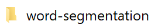
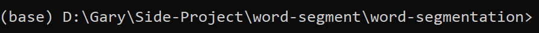
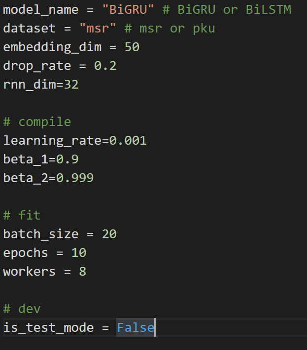
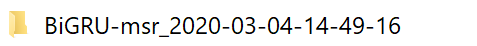
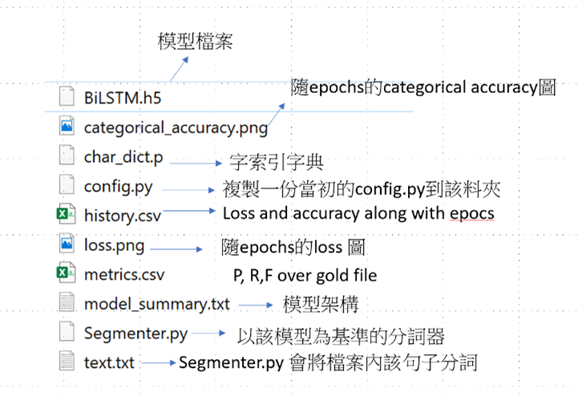

# 中文分詞模型 Chinese word segmentation</h1>
1. 解壓縮完進入到  
 
2. 將[icwb2-data](http://sighan.cs.uchicago.edu/bakeoff2005/)資料夾放word-segmentation裡面  
3. 如何訓練模型  
   1. 開啟cmd,並進入到有tensorflow2.0以上版本的環境,以及進入word-segmentation資料夾 
   2. 確認[config.py](./word-segmentation/config.py)
     
   3. 在cmd輸入 python [Train.py](./word-segmentation/Train.py), 即可開始訓練 並產生訓練結果資料夾  
    (名稱為: model_name-dataset _ time)  
    Ex: 
    4. 訓練結果資料夾包  
     

## 如何分詞
1.	開啟cmd,並進入到有tensorflow2.0以上版本的環境,以及進入訓練後模型資料夾  
    EX: 
2.	將欲分詞的句子輸入在[text.txt](./word-segmentation/text.txt)
3.	在cmd輸入 python [Segmenter.py](./word-segmentation/Segmenter.py)
4.	會產生分完詞結果的text_seg.txt檔案(訓練後模型資料夾內)

